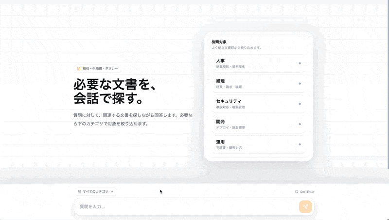
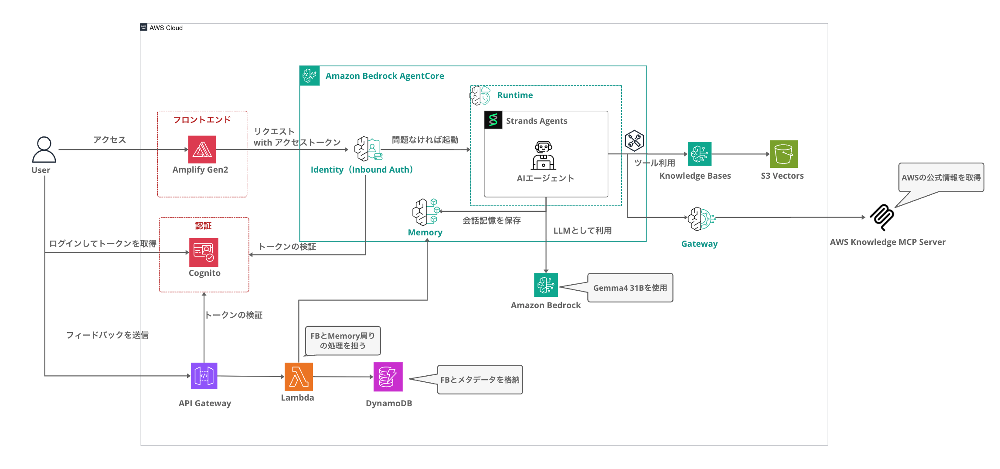

# Gemma 4 31B + AgentCore ナレッジ検索サンプル

Gemma 4 31B と Amazon Bedrock AgentCore を組み合わせた、ナレッジ検索サンプルアプリケーションです。
Amplify Gen 2 を使い、フロントエンド、認証、検索基盤、エージェント実行環境を CDK でまとめて管理しています。



## このサンプルでできること

- 架空の業務ドキュメント（20件・5カテゴリ）に対して、チャット形式で質問・回答
- エージェントが必要に応じてナレッジベースを検索し、根拠に基づいた回答を生成
- AgentCore Gateway を有効にすると、AWS 公式ドキュメントも MCP 経由で検索可能
- 回答品質を Gemma 4 31B 自身が LLM-as-a-Judge で自動評価（15問テストセット付き）

## アーキテクチャ



### 使用サービス

| 役割 | サービス |
|------|----------|
| LLM | Google Gemma 4 31B（bedrock-mantle の OpenAI 互換 API 経由） |
| エージェント | Strands Agents SDK |
| ナレッジベース | Amazon Bedrock Knowledge Bases（S3 データソース + S3 Vectors） |
| Embedding | Amazon Titan Embedding v2（1024次元） |
| 会話メモリ | Amazon Bedrock AgentCore Memory |
| エージェント実行環境 | Amazon Bedrock AgentCore Runtime |
| MCP Gateway | Amazon Bedrock AgentCore Gateway（オプション） |
| 認証 | Amazon Cognito |
| 履歴 API | API Gateway REST API（Cognito User Pool Authorizer）+ Lambda + AgentCore Memory + DynamoDB |
| フィードバック | API Gateway REST API（Cognito User Pool Authorizer）+ Lambda + DynamoDB |
| フロントエンド | React + Vite + Tailwind CSS v4 |
| IaC | AWS Amplify Gen 2 + CDK |

## ディレクトリ構成

```
.
├── amplify/                  # Amplify Gen 2 バックエンド
│   ├── backend.ts            # CDK スタック定義
│   ├── parameters.ts         # デプロイオプション（Gateway の有効/無効など）
│   ├── auth/                 # Cognito 認証設定
│   └── functions/
│       ├── feedback/         # フィードバック収集用 Lambda
│       └── memory/           # 会話履歴・履歴メタデータ取得用 Lambda
├── agent/                    # AgentCore Runtime に載せるエージェント
│   ├── agent.py              # Strands Agent（KB 検索 + Memory + Gateway MCP）
│   ├── pyproject.toml        # Python 依存管理（uv / poetry 対応）
│   └── requirements.txt
├── seed/                     # サンプルドキュメント
│   ├── documents.json        # ドキュメント定義（20件・5カテゴリ）
│   └── docs/                 # テキスト＋メタデータファイル（デプロイ時に S3 へ自動アップロード）
├── eval/                     # RAG 品質評価
│   ├── evaluate.py           # LLM-as-a-Judge スクリプト
│   ├── questions.json        # テスト質問セット（15問）
│   └── results.json          # 評価結果
├── scripts/                  # 運用スクリプト
│   ├── get_cognito_token.py  # 評価用の Cognito アクセストークン取得
│   ├── feedback_summary.py   # フィードバック集計
│   └── feedback_export.py    # フィードバック CSV エクスポート
├── src/                      # React フロントエンド
│   ├── components/           # ChatMessage, ChatInput, Sidebar, ToolCallAccordion
│   ├── hooks/                # useChat, useSessions, useTheme
│   ├── lib/                  # S3 署名付き URL 生成, 履歴取得, フィードバック送信
│   └── types/
└── docs/
    └── demo.gif
```

## 事前準備

- Node.js 24 以上
- Python 3.13 以上
- uv（評価・フィードバック集計などの Python スクリプト実行に使用）
- AWS CLI（認証情報設定済み）
- bedrock-mantle で Gemma 4 31B を利用できること
- Docker（AgentCore Runtime のコンテナビルドに使用）

### リージョンについて

このサンプルの LLM は `google.gemma-4-31b` を bedrock-mantle 経由で呼び出します。2026-06-14 時点では、東京リージョン（`ap-northeast-1`）ではこのモデルを利用できないため、`us-east-1` など対応リージョンでのデプロイを想定しています。

Amazon Bedrock の料金表には東京リージョンの Google Gemma も掲載されていますが、そこに記載されているのは Gemma 3 系のモデルです。この README で扱っている Gemma 4 31B とは別なので、リージョン選択時は混同しないようにしてください。

## セットアップ

### 依存パッケージのインストール

```bash
npm install
```

### デプロイ

`npx ampx sandbox` を実行すると、以下のリソースがまとめて作成されます。

- Cognito（認証）
- Bedrock Knowledge Base + S3 Vectors
- S3 へのサンプルドキュメントアップロードと KB 同期
- AgentCore Runtime（Gemma 4 31B エージェント）
- AgentCore Memory
- 会話履歴取得用 REST API + Lambda + DynamoDB
- フィードバック用 REST API + Lambda + DynamoDB

```bash
npx ampx sandbox --once
```

デプロイが完了すると `amplify_outputs.json` が生成されます。フロントエンドはこのファイルから Runtime ARN や API URL を自動的に読み取ります。

### フロントエンドの開発サーバー

```bash
npm run dev
```

ブラウザで開くと Cognito の認証画面が表示されます。サインアップ後、チャット画面からナレッジ検索を試せます。

### Gateway を有効にする（オプション）

AgentCore Gateway を有効にすると、エージェントが AWS 公式ドキュメントも MCP 経由で検索できるようになります。

```bash
ENABLE_GATEWAY=true npx ampx sandbox --once
```

有効/無効は `amplify/parameters.ts` で管理しています。

このサンプルでは AWS Knowledge MCP Server を Target として使っていますが、AgentCore Gateway には Lambda や独自の MCP Server なども接続できます。たとえば業務 API の呼び出し、社内システム連携、独自の計算処理などを Gateway 経由のツールとして追加できます。

ただし、Gateway 経由で独自処理を呼び出す場合は IAM 権限の設計が必要です。呼び出し元には `bedrock-agentcore:InvokeGateway`、Gateway から Target へアクセスする側には Lambda Function URL や AgentCore Runtime など対象サービスを呼び出す権限を付与します。MCP Server Target で IAM 認証を使う構成については、以下の記事も参考になります。

- [Amazon Bedrock AgentCore Gateway の MCP Server ターゲットで IAM 認証を使う例](https://dev.classmethod.jp/articles/amazon-bedrock-agentcore-gateway-mcp-server-target-iam-outbound-auth/)

### 本番デプロイ（Amplify Hosting）

このリポジトリを自分の GitHub アカウントにクローンして、Amplify Hosting で Git 連携デプロイができます。

1. このリポジトリをクローンし、自分の GitHub に新規リポジトリとして push する

```bash
git clone https://github.com/yuu551/gemma4-31b-agentcore-sample.git my-rag-app
cd my-rag-app
git remote set-url origin https://github.com/<your-account>/my-rag-app.git
git push -u origin main
```

2. `amplify/parameters.ts` を編集して、デプロイオプションを調整する

```typescript:amplify/parameters.ts
export const parameters = {
  // AgentCore Gateway（AWS Knowledge MCP）を有効にする場合は true に変更
  enableGateway: false,
};
```

3. Amplify コンソールで新しいアプリを作成し、GitHub リポジトリを連携する

   - Amplify コンソール → 「新しいアプリを作成」→ 「GitHub」を選択
   - リポジトリとブランチ（main）を指定
   - Amplify がビルド・デプロイを自動実行

以降は main ブランチに push するたびに自動デプロイされます。設定を変更したい場合は `parameters.ts` を編集して push するだけです。

## ドキュメントの追加・更新

このサンプルには架空の業務ドキュメントが 20件入っていますが、自分たちのドキュメントに差し替えて使えます。

### ドキュメントの形式

`seed/docs/` に、テキストファイルとメタデータファイルをペアで配置します。

```
seed/docs/
├── my-document.txt                  # ドキュメント本文
├── my-document.txt.metadata.json    # メタデータ（カテゴリ・タイトル）
```

メタデータファイルの形式は以下の通りです。

```json
{
  "metadataAttributes": {
    "category": {
      "value": { "type": "STRING", "stringValue": "hr" }
    },
    "title": {
      "value": { "type": "STRING", "stringValue": "ドキュメントのタイトル" }
    }
  }
}
```

`category` はフロントエンドのカテゴリフィルタに対応しています。現在のカテゴリは `hr`（人事）、`finance`（経理）、`security`（セキュリティ）、`engineering`（開発）、`operations`（運用）の 5 種類です。カテゴリを追加する場合は `src/types/chat.ts` の `CATEGORIES` 定義も合わせて更新してください。

### 反映方法

ドキュメントの追加・更新後に再デプロイすると、CDK の `BucketDeployment` が S3 にファイルをアップロードし、カスタムリソースが KB の Ingestion Job を自動実行します。

```bash
npx ampx sandbox --once
```

既存のサンプルドキュメントを残す必要がなければ、`seed/docs/` の中身をすべて差し替えて構いません。

### 評価セットの更新

ドキュメントを差し替えた場合は、`eval/questions.json` のテスト質問も合わせて書き換えてください。各質問には期待される回答（`ground_truth`）と参照ドキュメント名（`expected_doc`）を指定します。

## 主な機能

| 機能 | 説明 |
|------|------|
| ナレッジ検索 | エージェントが必要に応じてナレッジベースを検索して回答を生成 |
| メタデータフィルタリング | カテゴリ（人事・経理・セキュリティ・開発・運用）で検索対象を絞り込み |
| 会話メモリ | AgentCore Memory によるセッション間の会話履歴保持。履歴一覧のタイトルや最終更新時刻は DynamoDB に保存し、本文は Cognito Authorizer 付き REST API + Lambda 経由で取得する |
| Gateway（オプション） | AWS Knowledge MCP Server の検索に加えて、Lambda や独自 MCP Server をツールとして拡張可能 |
| ツール使用の表示 | エージェントが使ったツールと引数をアコーディオンで表示 |
| ドキュメントリンク | 参照元ドキュメントをクリックすると署名付き URL で開く |
| フィードバック | 回答に対する「いいね / 改善」やコメントを DynamoDB に記録 |
| LLM-as-a-Judge | Gemma 4 31B による回答品質の自動評価（15問テストセット） |
| ダーク / ライトモード | CSS 変数ベースのテーマ切替 |

## コストの考え方

以下は 2026-06-14 時点の料金ページをもとにした整理です。実際の金額はリージョン、モデル単価、リクエスト数、ドキュメント量、評価スクリプトの実行回数で変わります。

このリポジトリの Knowledge Base は S3 Vectors をベクトルストアとして使います。基本的に従量課金なので、使った分だけ課金される構成です。小規模な検証では、ベクトルストアよりも LLM 推論、AgentCore Runtime、Amplify Hosting のビルド・配信のほうが目立つ可能性があります。

### 主な課金ポイント

| 項目 | 課金の考え方 | このサンプルでの見方 |
|------|--------------|----------------------|
| LLM 推論 | 入力・出力トークン数に応じた課金 | Gemma 4 31B の単価と対応リージョンは bedrock-mantle 側の最新情報を確認してください。東京リージョンは非対応のため、README では固定額として断定しません。 |
| Embedding | ドキュメント取り込み時と検索時のクエリ埋め込みで発生 | 20件程度のサンプル文書では小さいです。再同期回数が増えると、その分だけ追加で発生します。 |
| S3 Vectors | ベクトルの保存、PUT、クエリ API、クエリ時の処理データ量 | このサンプル規模では小さいです。ただし、実際の保存量はチャンク数、メタデータ、キー長によって変わります。 |
| AgentCore Runtime | CPU とメモリのアクティブ消費時間 | 「1セッションいくら」ではなく、vCPU-hour と GB-hour で計算します。I/O 待ちなどは条件によって課金対象外になる場合があります。 |
| AgentCore Memory | 新規イベント、長期メモリ保存、検索リクエスト | 会話履歴を残すほど増えます。小規模検証では大きくなりにくいです。 |
| AgentCore Gateway | MCP 操作、Search API、ツール indexing | AWS Knowledge MCP を使う場合に発生します。月1000回規模では大きな金額にはなりにくいです。 |
| Cognito | MAU ベース | Essentials / Lite で直接サインインまたはソーシャル IdP の月1万MAU以内なら課金されません。Identity Pool による一時認証情報の発行は追加料金なしです。 |
| Amplify Hosting | ビルド分、CDN ストレージ、データ転送 | 標準ビルド $0.01/分、ストレージ $0.023/GB/月、転送 $0.15/GB が目安です。 |
| API Gateway + Lambda + DynamoDB | 会話履歴一覧・本文取得、フィードバック送信時の REST API 呼び出し、Lambda 実行、DynamoDB 書き込み | 月1000回程度の利用なら多くの場合かなり小さくなります。 |
| S3 | サンプル文書の保存 | このサンプル文書量では小さいです。 |

### 月1000回の質問で見る場合

LLM 推論だけを見ると、たとえば 1回あたり入力 1,000 tokens、出力 500 tokens なら、月1000回で入力 1,000,000 tokens、出力 500,000 tokens です。ここに利用モデルの単価を掛けると、おおよその推論コストを計算できます。

S3 Vectors は、AWS 料金ページの例ではストレージが $0.06/GB/月、PUT が $0.20/GB、クエリ API が $2.50/100万リクエストで示されています。実際の保存量とクエリ処理量は、ファイル数だけでなくチャンク分割後のベクトル数やメタデータ量によって変わります。

一方で、AgentCore Runtime、AgentCore Memory、Gateway、LLM-as-a-Judge、Amplify Hosting などは別に課金されます。特に評価スクリプトは、15問分の RAG 呼び出しに加えて judge モデル呼び出しも行うため、通常のチャット利用より多くの推論が発生します。

### 月1000回の概算明細

前提: `us-east-1`、月1000回の質問、1回あたり入力 1,000 tokens / 出力 500 tokens、Gateway 有効、LLM-as-a-Judge は未実行、サンプル文書のみ。

| 項目 | 前提 | 月額目安 |
|------|------|----------|
| Gemma 4 31B（推論） | 入力 1,000,000 tokens + 出力 500,000 tokens。us-east-1 の公式単価が入力 $0.14 / 1M tokens、出力 $0.40 / 1M tokens の場合 | 約 $0.34 |
| Embedding | サンプル文書の初回取り込み + 月1000回の検索クエリ埋め込み | 約 $0.01〜$0.05 |
| S3 Vectors（保存） | サンプル文書をチャンク化して保存。実際の保存量はチャンク数、メタデータ、キー長に依存 | 約 $0.01〜$0.05 |
| S3 Vectors（PUT） | 初回取り込み分。再同期を何度も行うと増加 | 約 $0.01〜$0.05 |
| S3 Vectors（クエリ） | 月1000回の検索。API 部分は $2.50 / 100万リクエスト | 約 $0.01〜$0.10 |
| AgentCore Runtime | 月1000回の短いチャット実行。CPU / メモリのアクティブ消費時間で課金 | 約 $0.50〜$2 |
| AgentCore Memory | 会話イベント保存、長期メモリ保存、メモリ検索 | 約 $0.10〜$1 |
| AgentCore Gateway | AWS Knowledge MCP を有効化。MCP 操作、Search API、Tool Indexing の従量課金 | 約 $0.01〜$0.10 |
| Cognito | Essentials / Lite、直接サインインまたはソーシャル IdP、月1万MAU以内 | $0 |
| Amplify Hosting | 月数回のビルド + 少量配信 | 約 $0.50〜$2 |
| API Gateway + Lambda + DynamoDB | 会話履歴一覧・本文取得とフィードバック、月1000回程度 | 約 $0.01〜$0.10 |
| S3 | サンプル文書の保存 | 約 $0.01 未満 |
| 合計目安 | 月1000回、Gateway 有効、評価スクリプト未実行、少量配信 | 約 $2〜$5 / 月 |

この表は小規模検証の目安です。実際の金額は、AgentCore Runtime の実行時間、会話メモリの保存量、Amplify Hosting のビルド回数や配信量で変わります。

参考:

- [Amazon S3 pricing](https://aws.amazon.com/s3/pricing/)
- [Amazon Bedrock AgentCore pricing](https://aws.amazon.com/bedrock/agentcore/pricing/)
- [Amazon Bedrock pricing](https://aws.amazon.com/bedrock/pricing/)
- [AWS Amplify pricing](https://aws.amazon.com/amplify/pricing/)
- [Amazon Cognito pricing](https://aws.amazon.com/cognito/pricing/)
- [AWS Lambda pricing](https://aws.amazon.com/lambda/pricing/)
- [Amazon API Gateway pricing](https://aws.amazon.com/api-gateway/pricing/)
- [Amazon DynamoDB pricing](https://aws.amazon.com/dynamodb/pricing/)

## RAG 品質評価

Gemma 4 31B 自身を審査員として、15問のテスト質問に対する回答品質を自動評価できます。

AgentCore Runtime は Cognito で保護しているため、まず Cognito のアクセストークンを取得します。

```bash
export COGNITO_ACCESS_TOKEN=$(npm run auth:token -- --username <EMAIL> --silent)
```

```bash
npm run eval -- \
  --runtime-arn <RUNTIME_ARN> \
  --region us-east-1 \
  --access-token "$COGNITO_ACCESS_TOKEN"
```

`<RUNTIME_ARN>` は、デプロイ後に生成される `amplify_outputs.json` の `custom.runtime_arn` に入っています。
`auth:token` は `amplify_outputs.json` の Cognito 設定を読み込みます。パスワードは対話入力、または `COGNITO_PASSWORD` 環境変数で指定できます。

忠実性（Faithfulness）・関連性（Relevancy）・完全性（Completeness）の3軸で1〜5のスコアを付けます。

サンプルドキュメントに対する評価結果です。一問一答のシンプルな質問セットかつ簡素な評価基準のため高めのスコアが出やすいので、参考値としてご覧ください。

| 観点 | スコア |
|------|--------|
| Faithfulness（忠実性） | 5.00 / 5.00 |
| Relevancy（関連性） | 5.00 / 5.00 |
| Completeness（完全性） | 4.47 / 5.00 |
| 総合 | 4.82 / 5.00 |

## 運用スクリプト

フィードバックを収集して回答品質を改善する際にご活用ください。集計表示と CSV エクスポートのスクリプトを用意しています。

```bash
# 集計表示
npm run feedback:summary -- --table <TABLE_NAME>

# CSV エクスポート
npm run feedback:export -- --table <TABLE_NAME> -o feedback.csv
```
